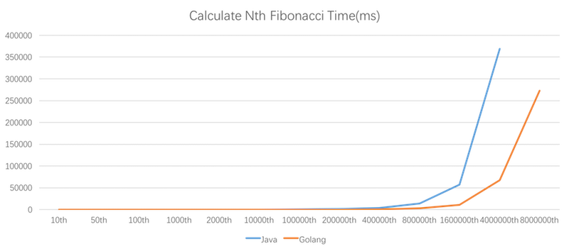

# Fast-fibonacci
Fibonacci is a famous teaching recursive algorithm for most new programmer. It's fun to studying Fibonacci algorithm's efficiency.
Now we will use some special skills to improve  efficiency, e.g. cache, more efficient programming languages and so on. Next we will write code to calculate the first N Fibonacci.

## Testing Hardware
- MacBook Pro (Retina, 15-inch, Mid 2015)
- 2.2 GHz Intel Core i7
- 16 GB 1600 MHz DDR3

## Java-fibonacci
### The slowest algorithm

```java
    public static long defaultFib(int n) {
        if (n < 3) return 1;
        return defaultFib(n - 1) + defaultFib(n - 2);
    }
```


Nth | value | time (ms)
:---|:---|:---
10 | 55 | 0
50 | 12586269025 | 41554
100 | - | -
1000 | - | - 

### The cache algorithm

```java
    public static Map<Integer,BigDecimal> fibCache = new HashMap<>();
    public static BigDecimal cacheFib(Integer i){
        if (i < 3){
            return new BigDecimal(1);
        }
        Function<Integer,BigDecimal> compute = j -> {
            BigDecimal left = cacheFib(j - 1);
            BigDecimal right = cacheFib(j - 2);
            BigDecimal result =  left.add(right);
            fibCache.put(i,result);
            return result;
        };
        return fibCache.computeIfAbsent(i,compute);
    }
```

Nth | value | time (ms)
:---|:---|:---
10 | 55 | 63
50 | 12586269025 | 61
100 | 354224848179261915075 | 66
1000 | Refer attachment 1000th.fib | 77 
2000 |  - | -

### By List

```java
    public static BigDecimal listCalcFib(Integer n) {
        if (n < 3) {
            return new BigDecimal(1);
        }
        List<BigDecimal> result = Lists.newArrayListWithExpectedSize(n - 1);
        result.add(new BigDecimal(1));
        result.add(new BigDecimal(1));

        for (int j = 2; j < n; j++) {
            result.add(result.get(j - 2).add(result.get(j - 1)));
        }
        return result.get(n - 1);
    }
```

Nth | value | time (ms)
:---|:---|:---
10 | 55 | 12
50 | 12586269025 | 13
100 | 354224848179261915075 | 15
1000 | Refer attachment 1000th.fib | 19 
2000 | Refer attachment 2000th.fib  | 20
10000 | Refer attachment 10000th.fib  | 35
100000  | Refer attachment 100000th.fib  | 769
200000  | Refer attachment 200000th.fib  | 2979
400000  | -  | -

### By Array

```java
    public static BigDecimal arrayCalcFib(Integer n) {
        if (n < 3) {
            return new BigDecimal(1);
        }
        BigDecimal[] result = new BigDecimal[n];
        result[0] = new BigDecimal(1);
        result[1] = new BigDecimal(1);

        for (int j = 2; j < n; j++) {
            result[j] = result[j - 2].add(result[j - 1]);
        }
        return result[n - 1];
    }
```

Nth | value | time (ms)
:---|:---|:---
10 | 55 | 2
50 | 12586269025 | 3
100 | 354224848179261915075 | 4
1000 | Refer attachment 1000th.fib | 5 
2000 | Refer attachment 2000th.fib  | 10
10000 | Refer attachment 10000th.fib  | 28
100000  | Refer attachment 100000th.fib  | 780
200000  | Refer attachment 200000th.fib  | 2918
400000  | -  | -

### By Local Variable

```java
    public static BigDecimal tmpVariableCalcFib(Integer n) {
        if (n < 3) {
            return new BigDecimal(1);
        }
        BigDecimal  result = new BigDecimal(0);
        BigDecimal first = new BigDecimal(1);
        BigDecimal second = new BigDecimal(1);

        for (int j = 2; j < n; j++) {
            result = first.add(second);
            first = second;
            second = result;
        }
        return result;
    }
```

Nth | value | time (ms)
:---|:---|:---
10 | 55 | 2
50 | 12586269025 | 2
100 | 354224848179261915075 | 3
1000 | Refer attachment 1000th.fib | 6
2000 | Refer attachment 2000th.fib  | 6
10000 | Refer attachment 10000th.fib  | 23
100000  | Refer attachment 100000th.fib  | 341
200000  | Refer attachment 200000th.fib  | 1174
400000  | Refer attachment 400000th.fib  | 3600
800000  | Refer attachment 800000th.fib  | 14271
1600000  | Refer attachment 1600000th.fib  | 57153
4000000  | Refer attachment 4000000th.fib  | 368908
8000000  | -  | -

## Go-fibonacci
### By Local Variable

```go
func TmpVariableCalcFib(n int) *big.Int {
	if n < 3{
		return big.NewInt(1)
	}
	result,first,second := big.NewInt(0),big.NewInt(1),big.NewInt(1)
	for j := 2; j < n;j++{
		result = first.Add(first,second)
		first = second
		second = result
	}
	return result
}
```

Nth | value | time (ms)
:---|:---|:---
10 | 55 | 0
50 | 12586269025 | 0
100 | 354224848179261915075 | 0
1000 | Refer attachment 1000th.fib | 0
2000 | Refer attachment 2000th.fib  | 0
10000 | Refer attachment 10000th.fib  | 0
100000  | Refer attachment 100000th.fib  | 38
200000  | Refer attachment 200000th.fib  | 164
400000  | Refer attachment 400000th.fib  | 659
800000  | Refer attachment 800000th.fib  | 2645
1600000  | Refer attachment 1600000th.fib  | 10585
4000000  | Refer attachment 4000000th.fib  | 67181
8000000  | Refer attachment 8000000th.fib  | 273284

# Summary

 According to the above data, we can see that：
 - The most efficient algorithm is Local variable exchange, because it can save a lot of memory and the time to alloct memory.
 - The efficiency of Golang programming language is much better than that of Java. 

 # Last
It only shows the code written by Java and Go, and we will add more programming languages later.Welcome anybody to submit pull request.

# License

[MIT License](http://zealzhangz.mit-license.org/)